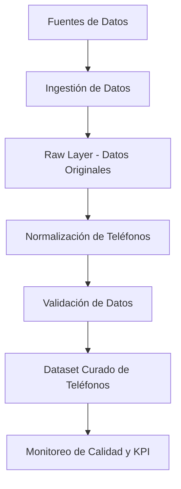
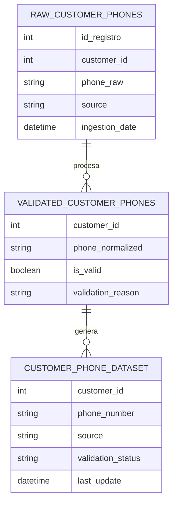

# Pipeline para la Construcción de un Dataset Confiable de Teléfonos de Clientes

## 1. Objetivo

Diseñar un proceso automatizado para la creación, validación y mantenimiento de un dataset confiable de números de teléfono de clientes.

La solución busca garantizar:

* calidad del dato
* trazabilidad del origen del teléfono
* validación automática
* disponibilidad del dataset para análisis y comunicación con clientes
* monitoreo mediante indicadores de calidad de datos (KPI)

---

# 2. Arquitectura de la solución

La solución se basa en un pipeline de procesamiento de datos que transforma los datos desde su estado original hasta un dataset validado y listo para consumo.



Este pipeline se ejecuta de manera **automática y periódica**, permitiendo mantener actualizado el dataset.

---

# 3. Fuentes de datos

Los números de teléfono pueden provenir de diferentes sistemas dentro de la organización.

| Fuente          | Descripción                               |
| --------------- | ----------------------------------------- |
| CRM             | Sistema de gestión de clientes            |
| App móvil       | Datos ingresados por usuarios             |
| Call Center     | Teléfonos registrados durante llamadas    |
| Formularios Web | Datos ingresados en registros de usuarios |

Debido a la existencia de múltiples fuentes, es necesario aplicar procesos de **normalización y validación** para garantizar consistencia.

---

# 4. Capa de datos crudos (Raw Layer)

En esta etapa se almacenan los datos **tal como llegan desde las fuentes**, sin modificaciones.

Esto permite:

* preservar el dato original
* mantener trazabilidad
* permitir auditorías y reprocesamientos

### Tabla: `raw_customer_phones`

| id_registro | customer_id | phone_raw      | source      | ingestion_date |
| ----------- | ----------- | -------------- | ----------- | -------------- |
| 1           | 101         | (300) 123-4567 | CRM         | 2026-03-01     |
| 2           | 101         | +57 3001234567 | APP         | 2026-03-01     |
| 3           | 102         | 300 999 0000   | CALL_CENTER | 2026-03-01     |

---

# 5. Normalización de teléfonos

Los teléfonos pueden registrarse en diferentes formatos.
Para poder analizarlos correctamente es necesario estandarizarlos.

Ejemplo de normalización:

| phone_raw      | phone_normalized |
| -------------- | ---------------- |
| (300) 123-4567 | 573001234567     |
| +57 3001234567 | 573001234567     |
| 300 123 4567   | 573001234567     |

Reglas aplicadas:

* eliminación de espacios
* eliminación de caracteres especiales
* estandarización del código de país
* conversión a formato numérico uniforme

---

# 6. Validación de datos

Después de normalizar los teléfonos se aplican reglas de validación para garantizar la calidad del dato.

### Reglas de validación

* longitud correcta del número
* prefijo de país válido
* formato numérico correcto
* detección de duplicados

### Tabla: `validated_customer_phones`

| customer_id | phone_normalized | is_valid | validation_reason |
| ----------- | ---------------- | -------- | ----------------- |
| 101         | 573001234567     | TRUE     | formato correcto  |
| 102         | 573009990000     | TRUE     | formato correcto  |
| 103         | 12345            | FALSE    | longitud inválida |

Los registros inválidos se almacenan para análisis posterior.

---

# 7. Dataset final de teléfonos

Los registros que superan las validaciones se almacenan en un dataset curado que será utilizado por los equipos de negocio.

### Tabla: `customer_phone_dataset`

| customer_id | phone_number | source      | validation_status | last_update |
| ----------- | ------------ | ----------- | ----------------- | ----------- |
| 101         | 573001234567 | CRM         | VALID             | 2026-03-01  |
| 102         | 573009990000 | CALL_CENTER | VALID             | 2026-03-01  |

Este dataset permite:

* enviar comunicaciones a usuarios
* realizar campañas de marketing
* mejorar la atención al cliente

---

# 8. Modelo de datos

El modelo de datos se divide en tres capas principales.



Este modelo permite mantener trazabilidad completa del dato desde su origen hasta el dataset final.

---

# 9. Automatización del pipeline

El pipeline se ejecuta automáticamente mediante un sistema de **orquestación de workflows de datos**.

Etapas automatizadas:

1. extracción de datos desde las fuentes
2. almacenamiento en la capa raw
3. normalización de teléfonos
4. validación de datos
5. actualización del dataset final

Este proceso puede ejecutarse **diariamente** o según las necesidades del negocio.

---

# 10. Control de versiones y CI/CD

La lógica del pipeline se mantiene en un repositorio con control de versiones.

El flujo de CI/CD permite:

* validar cambios en el código del pipeline
* ejecutar pruebas automáticas
* desplegar actualizaciones de forma controlada

Esto garantiza:

* reproducibilidad del proceso
* mantenimiento del pipeline
* trazabilidad de cambios

---

# 11. Monitoreo de calidad de datos

Para evaluar continuamente la calidad del dataset se definen indicadores de calidad de datos (KPI).

## KPI propuestos

### Porcentaje de teléfonos válidos

Mide la proporción de teléfonos que pasan las reglas de validación.

```
telefonos_validos / total_telefonos
```

Ejemplo:

| total teléfonos | válidos | porcentaje |
| --------------- | ------- | ---------- |
| 10000           | 9200    | 92%        |

---

### Porcentaje de teléfonos duplicados

```
telefonos_duplicados / total_telefonos
```

Este indicador permite identificar problemas de duplicidad.

---

### Distribución de teléfonos por fuente

| fuente      | cantidad |
| ----------- | -------- |
| CRM         | 5000     |
| APP         | 3000     |
| CALL_CENTER | 2000     |

Permite identificar qué sistemas generan más datos.

---

### Tasa de teléfonos inválidos

| motivo              | cantidad |
| ------------------- | -------- |
| longitud incorrecta | 200      |
| formato inválido    | 150      |
| prefijo incorrecto  | 50       |

Este indicador permite detectar problemas en los procesos de captura de datos.

---

# 12. Beneficios de la solución

La solución propuesta permite:

* mejorar la calidad de los teléfonos de clientes
* garantizar trazabilidad del origen de los datos
* automatizar la generación del dataset
* monitorear continuamente la calidad de los datos

Esto facilita que los equipos de negocio utilicen información confiable para mejorar la comunicación con los usuarios.

